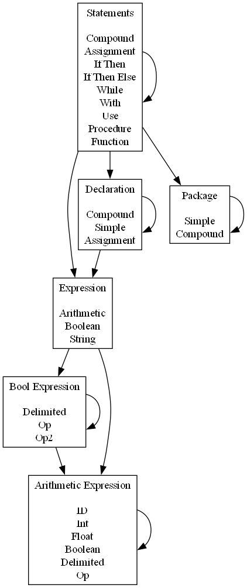

# Parte 2

### Ficheiros criados/incluidos no Trabalho:

- st.h - *definição da tabela de símbolos (lista ligada simples)*
- st.c - *implementação da tabela de símbolos (e print da tabela)*
- ic.h - *definição do código intermédio*
- ic.c - *implementação do código intermédio*
- mc.h - *definição da função de imprimir código MIPS*
- mc.c - *implementação da função de imprimir código MIPS*

### Mas afinal o que é isto de 'compilador'?

Código em Ada:
```
procedure Test is
    x : Integer;
    y : Integer;
begin
    y := 1;
    x := y + 2 * 3;
end Test;
```

Através de magia negra (flex + bison ('flexing bison' é um bom nome para uma banda, uma coisa indie alternativa)) cria-se a Abstract Syntax Tree (AST):
```
PROCEDURE(Test) IS(
    DCLR_SIMPLE(
        Integer(x)
    )
    DCLR_SIMPLE(
        Integer(y)
    )
BEGIN(
    ASSIGN(
        ID(y)
        ARITHMETIC_EXPRESSION(
            INT(1)
        )
    )
    ASSIGN(
        ID(x)
        ARITHMETIC_EXPRESSION(
            PLUS(
                ID(y)
                TIMES(
                    INT(2)
                    INT(3)
                )
            )
        )
    )
)) END_Test
```

Percorremos a AST à procura de variáveis. Vão todas para uma tabela. Chamamos a isto uma Symbol Table (ST):
```
ID: y, TYPE: Integer
ID: x, TYPE: Integer
```

Usando a AST e a ST gera-se Código Intermédio (IC), neste trabalho um código de 3 endereços:
```
t0 <- y
t0 := 1
t0 -> y
t0 <- x
t1 <- y
t3 := 2
t4 := 3
t2 := t3 * t4
t0 := t1 + t2
t0 -> x
```

Por fim, e como o IC é já muito parecido com o MIPS, é só traduzi-lo para MIPS. Sem esquecer de percorrer a ST uma última vez para declarar todas as variáveis:
```
.data
y: .word 0
x: .word 0
.text
main:
lw $t0, y
li $t0, 1
sw $t0, y
lw $t0, x
lw $t1, y
li $t3, 2
li $t4, 3
mul $t2, $t3, $t4
add $t0, $t1, $t2
sw $t0, x
```


### Notas:

#### Tabela de Símbolos:

- Integer (int em C)
- Real (float em C)

Estrutura muito simples, cada "nó" só guarda o nome da variável e o tipo da variável.

Representada como uma lista ligada simples de nós.

#### Código Intermédio

2 estruturas: uma para guardar as instruções de código intermédio e uma para guardar nós de uma lista de instruções.

Instr:

Estrutura com Opcode (tipo de instrução) e 3 endereços (código de 3 endereços, usar NULL para as instruções que requerem menos).

Guardei também as operações binárias aqui (+,-,etc.). Isto porque se guardarmos só OP como está no slides, como é que sabemos que tipo de operação estamos a fazer? Só se, em vez de guardar OP como um opcode, guardassemos o tipo de operação como opcode. Não sei.

ic_node:

Lista ligada simples: cada nó guarda uma instrução e o próximo nó.

Usar head e tail: head para percorrer a lista, tail para adicionar (queremos adicionar instruções por ordem, ou seja, fazer append ao fim da lista).


# Parte 1

### Ficheiros criados/incluidos no Trabalho:

- Makefile - *macro para compilar os ficheiros todos na ordem correcta e ligar o que for necessário*
- scanner.flex - *tokens de leitura*
- parser.bison - *regras da gramática*
- ast.h - *definição das estruturas da Árvore Sintática Abstracta (AST)*
- ast.c - *implementação das funções definidas em ast.h*
- printASTv1.h / printASTv2.h - *declaração das funções (para outros ficheiros poderem importar as funções de impressão)*
- printASTv1.c / printASTv2.c - *funções para imprimir a AST*
- interpreter.c - *lê o input e imprime a AST*

### Para correr basta fazer:

`$ make`

`$ make tests`

ou individualmente,

`$ ./interpreter < tests/input1.txt`

### O que está incluido:



Comandos (statements):
- assigment
- if then else
- while
- procedure
- function
- with, use

Expressões:
- aritméticas
- booleanas
- strings

### Notas:

#### Assignment:

Há dois tipos de assignment:
- o assignment declarativo `x : Integer := 42`
- o assignment não declarativo (no meio do código) `x := x + 1`

O assignment não declarativo é um Statement, pode aparecer em qualquer parte do código.

O assignment declarativo só aparece na parte declarativa de um Procedure, entre `is` e `begin`, por exemplo:
```
procedure Main is
  x : Integer := 42
begin
  Put_Line(x);
end Main;
```

Por isso, temos um tipo, Dclr, declarações, que pode ser vazio, ou uma lista, que aparece entre `is` e `begin` num Procedure.


#### If Then Else:

O If Then Else foi implementado como o exemplo do slide 24 da aula teórica 6.

```
Stm -> if Exp then Stm
Stm -> if Exp then Stm else Stm
```

Ou seja, com a resolução shift do dangling else.


#### With, Use:

Para as funções Put_Line() e Get_Line() temos de incluir dois comandos, `with` e `use`.

Como estes comandos podem ter como argumento um package do tipo `Package1.Package2.Package3`, temos uma estrutura Pckg para construir os Packages com separador `.` (ponto). 


#### Function:

As duas funções a implementar (Put_Line() e Get_Line()) não precisam de devolver nada, por isso são Comandos e não Expressões.

A função Put_Line(argument) faz output do argument, e a função Get_Line(argument) recebe input para o argument.


#### Strings:

As strings são simplesmente mais uma expressão, que tem como atributo um simples char*.

Requer trabalho adicional no scanner.flex para remover as aspas. Isto porque o Flex não tem capture groups nas expressões regulares, senão podiamos fazer só `\"(.*)\"` e apanhar só o que está dentro de parentesis.

Ou seja, se o scanner ler `"isto é uma string"` deve guardar no yylval.string_val `isto é uma string`.

Para podermos fazer output de strings com o Put_Line().


#### Booleans:

(A implementação dos bools é temporária e não óptima)

O tipo bool pode aparecer sozinho, mas também em expressões do tipo `x = false` ou `y /= true`.

Como os ID estão definidos nas expressões aritméticas, a única forma de obter estas expressões é colocar o tipo bool nas expressões aritméticas.


## Referências Consultadas:

https://learn.adacore.com/courses/Ada_For_The_CPP_Java_Developer/chapters/04_Statements_Declarations_and_Control_Structures.html

https://ada-lang.io/docs/arm/AA-10/AA-10.1

https://ada-lang.io/docs/learn/overview/building-blocks
